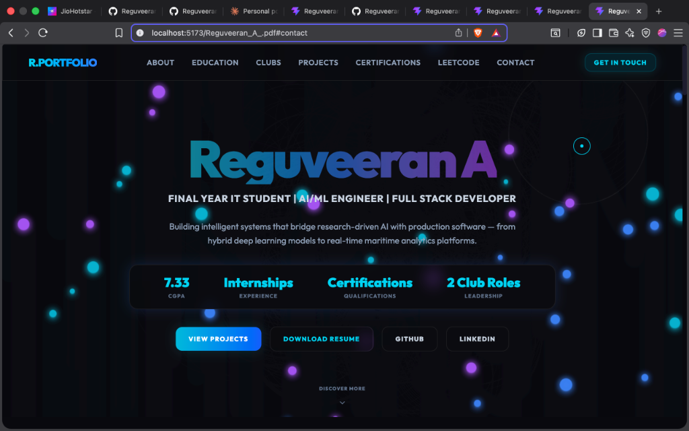
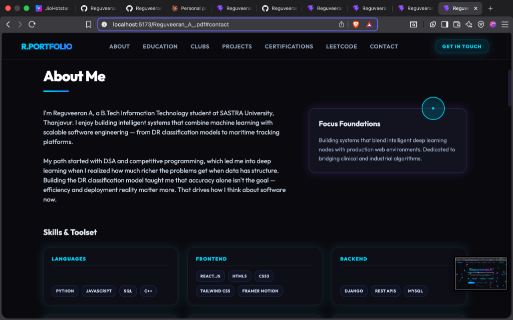
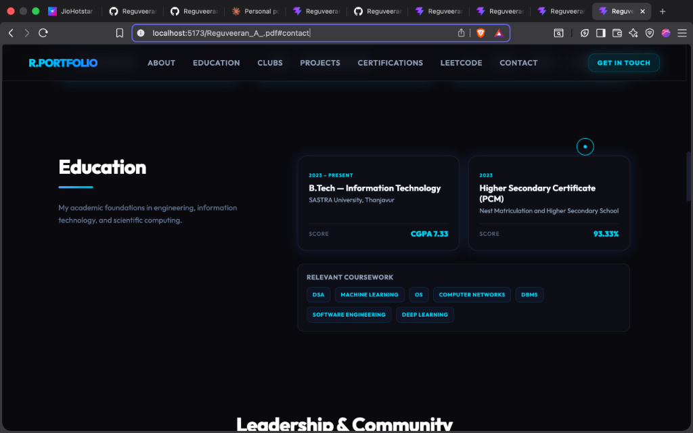
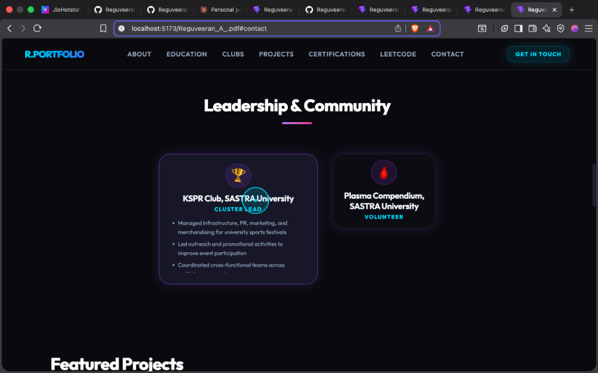
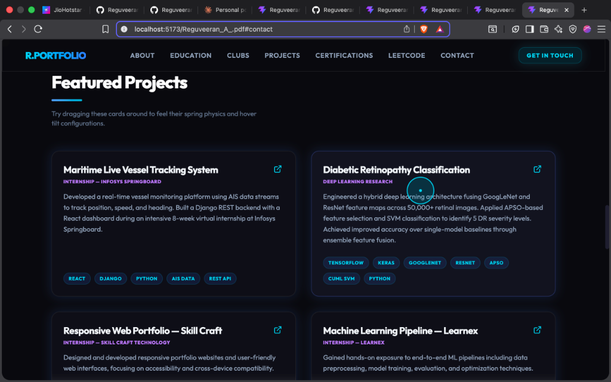
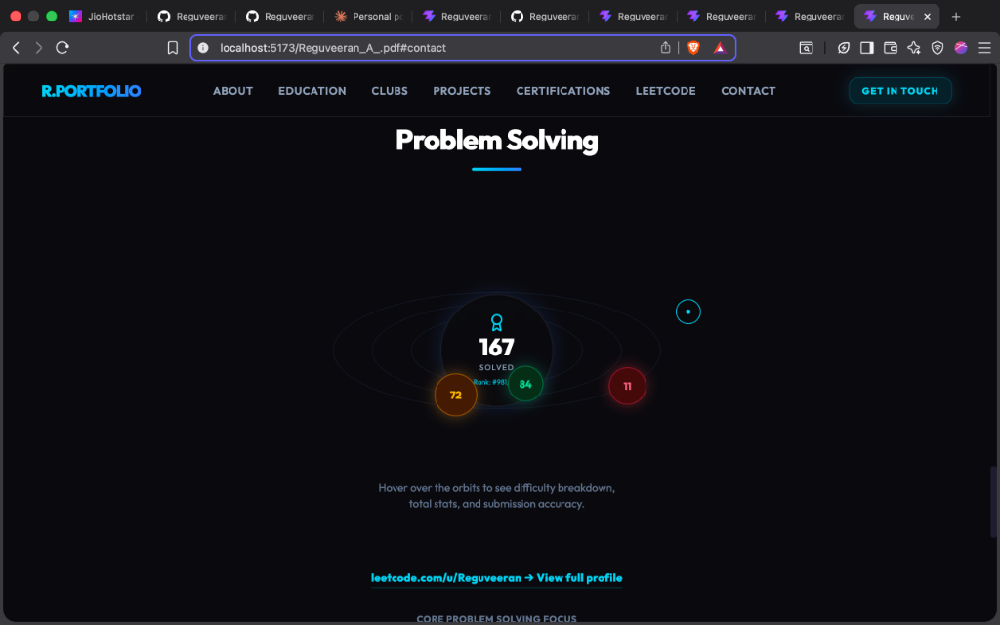

# Interactive Physics-Based Developer Portfolio 🚀

[](https://vite.dev/)
[](https://react.dev/)
[](https://brm.io/matter-js/)
[](https://tailwindcss.com/)

A premium, interactive developer portfolio showcasing AI/ML engineering, competitive programming stats, and full-stack software development projects. The application utilizes a physical simulation engine, custom spring dynamics, and smooth viewport transitions.

---

## 🎨 Visual Showcase & Walkthrough

Below are the key sections and interactive features of the portfolio.

### 1. Hero Particle Field & Stats
The hero header renders a lightweight particle field drifting upward. A repulsion field gently pushes particles away from the cursor while drawing connection lines to demonstrate cursor gravity.


### 2. About & Categorized Tech Stack
A sleek layout detailing B.Tech Information Technology foundations and a modular, categorized grid representing different technologies (Languages, Frontend, Backend, AI/ML, Core CS, and Tools).


### 3. Academic Timeline (Education)
A card grid detailing scores (CGPA 7.33, HSC 93.33%), durations, and a comprehensive coursework tag system for rapid academic screening.


### 4. Interactive Club badges
Sports and community leadership roles presented as hover-expandable badge elements. Hovering triggers a physics-based spring container expansion revealing detail lists.


### 5. Featured Projects (3D Hover & Drag Snap-Back)
Project showcase cards using 3D coordinate tilt on mouse-over. Clicking and dragging the card floats it on screen, snapping back to place with an elastic overshoot bounce upon release.


### 6. Interactive LeetCode Orbit Widget
Renders difficulty-based orbits (Easy, Medium, Hard) revolving in a 3D simulated depth ellipse around the total solved count. Hovering pauses the orbits and brings details into focus.


---

## 🛠️ Technology Stack & Physics Engines

- **Core Framework**: React 19 (Vite Build)
- **Physics Simulation**: Matter.js (Bubble particle drift & cursor repulsion boundaries)
- **Spring Animations**: `@react-spring/web` (Interactive project card dragging & spring expansion)
- **Scroll & Keyframe Animations**: `framer-motion` (Viewport triggered fade-ups and floating loops)
- **Styling**: Tailwind CSS v4 (Glassmorphic panels, glowing backdrops, and custom scrollbars)
- **Iconography**: `lucide-react`

---

## 📂 Project Structure

```bash
regu-portfolio/
├── src/
│   ├── assets/          # Static assets and icons
│   ├── components/      # Modular layout components
│   │   ├── ClubBadge.jsx       # Springs-expandable leadership roles
│   │   ├── FloatingSection.jsx # Viewport enter transition cards
│   │   ├── HeroCanvas.jsx      # Matter.js particle simulation
│   │   ├── LeetCodeOrbit.jsx   # requestAnimationFrame orbit widgets
│   │   ├── ProjectCard.jsx     # Springs-drag snapback cards
│   ├── data/
│   │   └── portfolio.js        # Core curriculum vitae data content
│   ├── App.jsx          # Main page assembly & cursor springs
│   ├── index.css        # Tailwind directives and custom animation rules
│   └── main.jsx
├── index.html
├── vite.config.js
└── package.json
```

---

## ⚙️ Local Development Setup

To run the portfolio server locally:

1. **Clone the repository**:
   ```bash
   git clone https://github.com/Reguveeran/Portfolio.git
   cd Portfolio
   ```

2. **Install dependencies**:
   ```bash
   npm install
   ```

3. **Start the local development server**:
   ```bash
   npm run dev
   ```

4. **Compile production build**:
   ```bash
   npm run build
   ```
